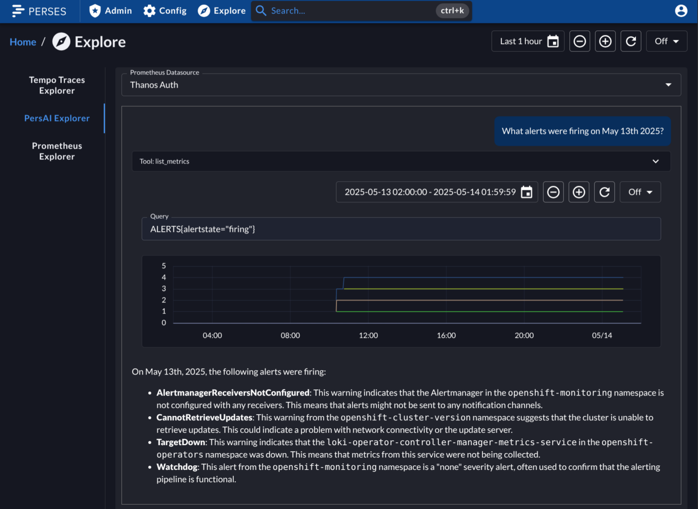
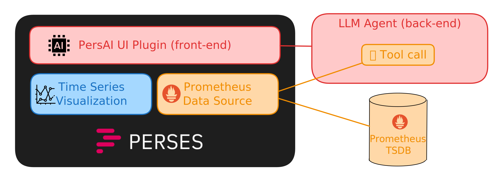

# PersAI

An AI assistant for [Perses](https://perses.dev/): the open observability
dashboard tool.

## Goal

Bring the LLM capabilities into the Perses world.

## Installation

1. Follow [the back-end installation instructions](./backend/README.md#quick-start) 
2. Follow [the front-end installation instructions](./frontend/README.md#quick-start)

## Current state

The current version includes a simple explore plugin that provides a chat
interface on top of the selected Prometheus data source. When the agent runs the
tool query, the UI plugin displays the details of the tool call using Perses
native visualizations.

Features:

- have a conversation on top of the Prometheus data
- visualize the generated queries directly in the chat interface
- back-end running against multiple LLM providers (powered by
  [Llama Stack](https://llama-stack.readthedocs.io/))
- tool calls performed through Perses data-source proxy (no extra data-sources configuration)
  
## Ideas for future development

While the core functionality is there, it's still just scratching the surface
of what's possible. This might include:

- bi-directional integration with existing dashboards 
  - import context from the dashboard
  - export the queries from the chat to the dashboard
- include multiple data-sources (not necessary only Prometheus) in the conversation
- customization of the in-chat visualizations
- tools for curating the context and chat history to direct the conversation
- include addition context (documentation, SOPs)
- agentic interaction style

## Architecture

The project is composed of a back-end service and a front-end Perses UI plugin.

The back-end service configures an LLM agent and exposes its features via
an HTTP interface. The agent talks to the Prometheus through the Perses proxy.

Perses user's access tokens are used to authorize against the back-end server.
The token is also used to authorize the tool call back against the Perses.
The tokens are not exposed outside the backend-service (e.g. to the LLM provider).

The front-end UI plugin shows the textual content (assuming markdown formatting)
as it is getting streamed from the back-end service. The tool calls are captured and
mapped to appropriate visualization Perses provides (currently, only range
queries are supported). Other tool calls (such as listing the metrics) are
displayed in a raw format.

## Caveats

**Security Risk of Configuring Backend URL via a Global variable**

In the current version, the information about the back-end url is provided via
"persai_url" global variable. Given the UI authorizes against this back-end
with Perses cookies, a malicious user with ability to update the global variable
could direct the requests to a different endpoint and hijack the tokens.

**Chat Sessions Lost After Restart**

Due to the current limitations on [Llama Stack](https://github.com/meta-llama/llama-stack)
side, the conversation history is not preserved upon restart of the backend service.
This needs to be resolved before considering more production setup. One also needs
to account on that when using back-end code reload functionality with `--reload`,
and refresh the chat interface to initiate a new chat session.
